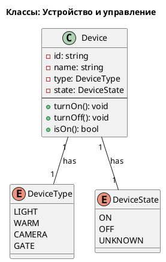

# Диаграмма кода компонента управления устройствами

```plantuml
@startuml CodeDiagram
title Классы: Устройство и управление


class Device {
  - id: string
  - name: string
  - type: DeviceType
  - state: DeviceState
  --
  + turnOn(): void
  + turnOff(): void
  + isOn(): bool
}

enum DeviceType {
  LIGHT
  WARM
  CAMERA
  GATE
}

enum DeviceState {
  ON
  OFF
  UNKNOWN
}
 
Device "1" -- "1" DeviceType : has
Device "1" -- "1" DeviceState : has

@enduml
```